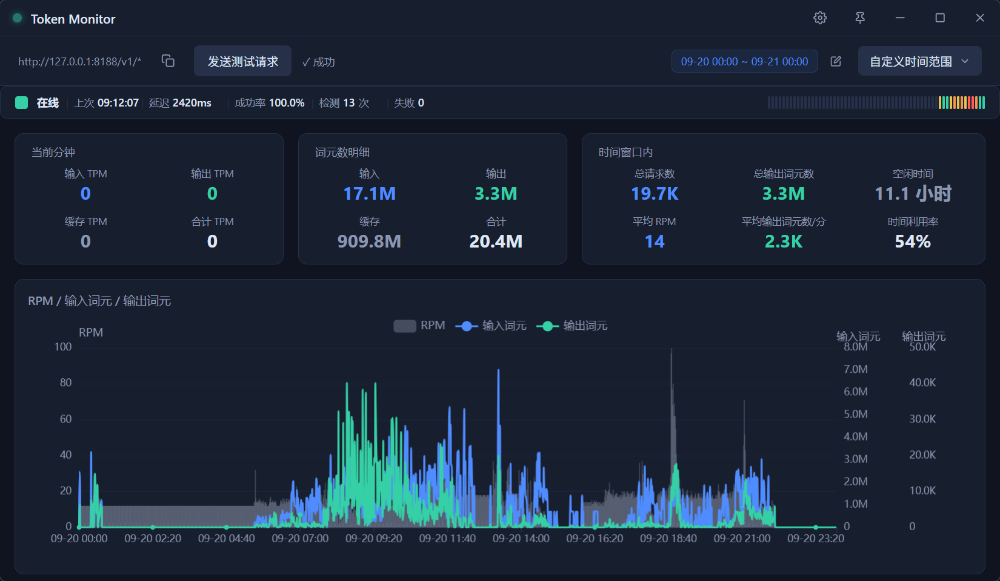

# Token Monitor

**简易 AI 网关**：本地代理 + RPM/TPM 实时统计，零配置开箱即用。

支持 OpenAI / DeepSeek / Anthropic 等兼容上游的多渠道智能调度，适用于日常开发、API 调试和成本监控。

<p align="center">
  
</p>

## 下载

从 [GitHub Releases](https://github.com/icehomura/token-monitor/releases/latest) 下载对应平台安装包：

| 平台 | 文件 |
|------|------|
| Windows x64 | `*_x64-setup.exe` |
| macOS Apple Silicon | `*_aarch64.dmg` |
| macOS Intel | `*_x64.dmg` |
| Linux x64 | `*_amd64.AppImage` / `*.deb` |
| Linux ARM64 | `*_aarch64.AppImage` / `*.deb` |

首次打开 macOS 应用：终端执行 `xattr -cr /Applications/Token\ Monitor.app`，或在系统设置 → 隐私与安全性中点击「仍要打开」。

## 功能

**代理服务** — 启动即自动监听 `http://127.0.0.1:8188`

三种 API 格式均支持，自动转换转发：

- `POST /v1/chat/completions` — OpenAI Chat Completions 格式
- `POST /v1/responses` — OpenAI Responses 格式
- `POST /v1/messages` — Anthropic Messages 格式

SSE 流式透传，上游 5xx 自动重试。

**多渠道智能调度**

- 支持同时配置多个上游渠道（不同 API Key / 模型 / 格式）
- 按权重加权随机分配流量，每个渠道独立并发 / RPM / TPM 限制
- 实时前端面板展示各渠道调度状态

**RPM / TPM 统计**

- ECharts 实时图表，按分钟分桶对齐
- 时间维度：近 5 / 10（默认）/ 30 分钟、1 小时、5 小时、今日
- 请求完成即刻刷新（事件驱动 + 5 秒兜底）

**探针与余额**

- AI 服务探针：定期探测上游可用性，展示延迟与成功率
- DeepSeek 余额：标题栏实时显示账户余额（仅官方上游），每次请求完成后按渠道自动查询
- 探针与余额设置自动保存，无需手动点击

## 配置

配置从 `token-monitor.json` 读取（也可全部在设置界面中修改）。

**文件位置**：

| 平台 | 位置 |
|---|---|
| Windows | exe 同目录 |
| macOS | `~/Library/Application Support/com.icehomura.token-monitor/` |
| Linux AppImage | `.AppImage` 同目录 |

**示例配置**（参考 `token-monitor.example.json`）：

```json
{
  "port": 8188,
  "profiles": [
    {
      "id": "channel-1",
      "name": "DeepSeek",
      "upstream_url": "https://api.deepseek.com/v1/responses",
      "api_key": "sk-xxx",
      "model_override": "",
      "upstream_format": "responses",
      "max_concurrency": 20,
      "enabled": true,
      "max_rpm": 0,
      "max_tpm": 0,
      "weight": 100
    }
  ]
}
```

| 字段 | 说明 |
|---|---|
| `upstream_format` | 上游格式：`responses`（默认）/ `chat_completions` / `anthropic` |
| `max_concurrency` | 该渠道最大并发数 |
| `max_rpm` / `max_tpm` | 每分钟请求数 / Token 限制，0 为不限制 |
| `weight` | 加权随机权重，默认 100 |

## 开发

```bash
# 安装前端依赖
bun install

# 仅前端开发（Vite 热更新）
bun run dev

# 完整 Tauri 开发（前端 + Rust 后端 + 热更新）
bun run tauri dev

# 构建发布版本
bun run tauri build
```

后端测试：`cd src-tauri && cargo test`（68 个单元 / 集成测试）

## 技术栈

- **后端**：Rust + Axum + SQLite（WAL）
- **前端**：Vue 3 + Vite + ECharts
- **框架**：Tauri 2
